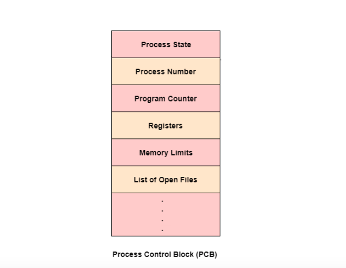
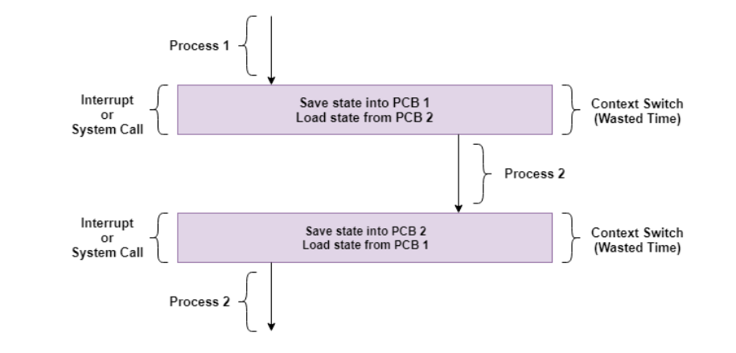

# Laboratorio 4 - Simulación de Multitask (Context Switch)

## 1. Simular Multitask cambio de contexto usando punteros a función

Para entender el multitasking que realiza el Sistema Operativo hay que definir que es multitask y que es Contex Switch.

### Multitask:   
Es la capacidad que tiene el sistema operativo que permite al usuario realizar mas de una tarea computacional al mismo tiempo. El sistema operativo es capaz de llevar un registro de que tareas está realizando y a la vez es capaz de realizarlas sin perder información de cada una.    
Un ejemplo de multitasking es cuando se esta escuchando música y navegando por internet. Ambos estan realizando sus diferentes funciones en la computadora, la música continua reproduciendose al mismo tiempo que la persona abre nuevas pestañas y carga diferentes páginas de internet sin alguna interrupción. 

### Context Switch  
Es el proceso que realiza el CPU para cambiar de una tarea a otra asegurandose de las tareas no tengan conflictos entre ellas. Esto es esencial si se desea proveer un multitasking user-friendly.   
Lleva la palabra *Context* porque antes de realizar el cambio de una tarea a otra este guarda su Contexto, es decir, guarda en una *tabla* la información importante de la tarea que esta realizando. Esta tabla es llamada  PCB (Process Control Block), algunos de los items que almacena la PCB son:
* **Process State:**  
Especifica el estado del proceso actual - Nuevo, Listo, Corriendo, Esperando, Terminado. 
* **Process Number:** 
Es el número identificador del proceso, es unico y distingue al proceso de los demas en el sistema. 
* **Program Counter:**   
Contiene la dirección de la siguiente instrucción a ejecutar.
* **Registers:**   
 Incluyen todos los registros que el proceso este utilizando, estos pueden incluir a accumulators, index registers, stack pointers, general purpose registers etc.
* **Información de Scheduling:**    
La prioridad que tiene el proceso en el sistema y la direccion de la cola donde se almacena.
* **I/O Status Information:**   
Esta información incluye la lista de dispositivos que está utilizando el proceso.



El Context Switch puede ser provocado por tres diferentes motivos: 
* **Multitasking:**   
Una tarea realiza un context switch para que otra tarea tenga el control del CPU también y lo ejecutar su proposito. 
* **Interrupt Handling:**   
El hardware cambia de contexto cuando una interrupción es ocurren en el sistema, esto ocurre automaticamente. 
* **User and Kernel Mode Switching:**    
Occurre cuando el sistema operativo necesita cambiar de Mode para realizar tareas con mayor privilegios (Kernel Mode) en el hardware o esta regresando de este mode a un mode con menos privilegios (User Mode.

Basicamente el Sistema Operativo solo puede realizar una tarea a la vez. Sin embargo, debido a que el CPU es demasiado rápido puede realizar sub-divisiones de tareas en un tiempo muy corto una tras otra, que a los ojos humanos pareciera que están siendo ejecutadas al mismo tiempo. 

El siguiente diagrama representa el proceso de Context Switch:



A continuacion se realiza un ejemplo de la simulacion de Context Switch utilizando funciones para simular el cambio de la ejecucion de procesos:   
Se declaran dos *procesos*, estos procesos tendran un tiempo limite para utilizar el procesador. Este tiempo disponible para cada proceso se irá incrementando con cada **tick** que el procesador realice. Al acabar su tiempo, se hara hará una interrupcion al CPU y se realizará un cambio de proceso para utilizar el procesador. Toda esta ejecución termina hasta que la variable *count* llegue a 3, esta variable se incrementara cada vez que haya un cambio de proceso. 


```c++
#include <stdio.h>
#include <dos.h>
#include <conio.h>

#define INTR 0X1C /* The clock tick interrupt */

//https://en.wikipedia.org/wiki/BIOS_interrupt_call
//http://stanislavs.org/helppc/int_table.html

#ifdef __cplusplus //macro para definicion de argumentos de C o C++
    #define __CPPARGS ...
#else
    #define __CPPARGS
#endif

void interrupt ( *oldhandler)(__CPPARGS); //prototipo para la interrupcion
typedef void (*pcbHandler)(); //prototipo para handler de funcion

int count=0;

struct PCB{ //estructura que utilizara cada "proceso"
 int quantum; //QUANTUM: tiempo maximo que un proceso
              //puede hacer uso del procesador
 int quantumProgress; // variable para ver el progreso del quantum
 pcbHandler fn; //handler para funcion
};

int x,y=0;

//funciones a utilizar por cada proceso
// si el proceso a se esta ejecutando, la variable x se incrementa en 1
void func1(){
  x++ ;
}
// si el proceso b se esta ejecutando, la variable y se incrementa en 3
void func2(){
 y = y+3;
}
PCB a,b, *currentProcess; //declaramos dos variables de PCB
                          // y un tipo puntero a una PCB

void interrupt handler(__CPPARGS){ //handler nuevo que entrara en ejecucion
                                  // al hacer la interrupcion

   count++;
   //se optiene el progreso del quantum del proceso actual
   currentProcess->quantumProgress++;
   // si el progreso de su quantum es mayor a su limite de quantum, entra
   if(currentProcess->quantumProgress > currentProcess->quantum){
     // si el proceso corriendo es el a, cambiar al proceso b o viceversa
     if(currentProcess==&a){
	      currentProcess=&b;
     }else{
        currentProcess=&a;
     }
     //setear el progreso del quantum del proceso actual a 0
     // porque es el nuevo proceso que esta iniciando
     currentProcess->quantumProgress=0;

   }
   // llamar al handler viejo
   oldhandler();
}

int main(void){

   int CQ;
   int CQP;
   // se iniciara con el proceso a
   currentProcess = &a;
   //limite de quantum para cada proceso
   a.quantum = 5;
   b.quantum = 3;
   // funcion que cada proceso utilizara
   a.fn = func1;
   b.fn = func2;

   // se almacena el vector de interrupcion viejo
   oldhandler = getvect(INTR);

   //se instala el nuevo handler para el vector de interrupcion
   setvect(INTR, handler);

  //el proceso de cambio de proceso en ejecucion se termina hasta que
  //count se auto incremente a 3
   while (count < 3){
     //obtenemos el limite de quantum del proceso en ejecucion actual
      CQ=currentProcess->quantum;
      //obtenemos el progegreso del quantum del proceso en ejecucion actual
      CQP=currentProcess->quantumProgress;
      //Imprimimos valores del proceso en ejecucion actual
      printf("Count es: %d, X: %d, Y: %d Lim Quantum: %d Progeso Quantum: %d\n", count, x, y, CQ, CQP);

      // se ejecuta la funcion del proceso a o b, dependiendo
      // de que proceso se esta ejecutando actualmente
      (*current).fn();
   }

   //se setea el handler de la interrupcion vieja
   setvect(INTR, oldhandler);
   getch();
   return 0;
}
```

## 2. Simular Multitask con cambio de contexto real
A continuacion se realiza un ejemplo de simulación de Contex Switch, muy similar al anterior, con la diferencia que se obtiene la direccion de la funcion que el proceso actual utiliza. Se asemeja al Context Switch ya que en cada cambio de proceso, el procesador utiliza una nueva funcion diferente al proceso anterior. Es decir, cada puntero direccion a otras variables debido al cambio de contexto. 


```c++
#include <stdio.h>
#include <dos.h>
#include <iostream.h>

#define INTR 0X1C /* The clock tick interrupt */

//https://en.wikipedia.org/wiki/BIOS_interrupt_call
//http://stanislavs.org/helppc/int_table.html

#ifdef __cplusplus //macro para definicion de argumentos de C o C++
    #define __CPPARGS ...
#else
    #define __CPPARGS
#endif

void interrupt ( *oldhandler)(__CPPARGS); //prototipo para la interrupcion
typedef void (*pcbHandler)(); //prototipo para handler de funcion

int count=0;

// funciones que utilizara  cada procesador
void funcPross1(){} 
void funcPross2(){}

struct PCB{ //estructura que utilizara cada "proceso"
 int quantum; //QUANTUM: tiempo maximo que un proceso
              //puede hacer uso del procesador
 int quantumProgress;// variable para ver el progreso del quantum
 void (*funcCodeSeg)(); //puntero que almacenara  la direccion de
                        //la funcion utilizada actualmente

};


PCB process1, process2, *currentProcess; //declaramos dos variables de PCB
                                          // y un tipo puntero a una PCB

void interrupt handler(__CPPARGS){ //handler nuevo que entrara en ejecucion
                                    // al hacer la interrupcion

   count++;
   //se optiene el progreso del quantum del proceso actual
   currentProcess->quantumProgress++;
   // si el progreso de su quantum es mayor a su limite de quantum, entra
   if(currentProcess->quantumProgress > currentProcess->quantum){
     // si el proceso corriendo es el Proceso1, cambiar al Proceso2 o viceversa
     if(currentProcess == &process1){
	      currentProcess = &process2;
        //almacena la direccion de la funcion a utilizar
        currentProcess->funcCodeSeg = &funcPross2;
     }else{
        currentProcess = &process1;
        //almacena la direccion de la funcion a utilizar
        currentProcess->funcCodeSeg = &funcPross1;
     }
     //setear el progreso del quantum del proceso actual a 0
     // porque es el nuevo proceso que esta iniciando
     currentProcess->quantumProgress=0;

   }
   // llamar al handler viejo
   oldhandler();
}


int main(void){

  int CQ;
  int CQP;
  void (*funcCodeSeg)();
  // se iniciara con el proceso1
  currentProcess = &process1;
  //limite de quantum para cada proceso
  process1.quantum = 2;
  process2.quantum = 3;

  /* guardar el antiguo vector de interrupcion */
  oldhandler = getvect(INTR);

  /*setear el nuevo handler para la interrupcion*/
  setvect(INTR, handler);

  //el proceso de cambio de proceso en ejecucion se termina hasta que
  //count se auto incremente a 3
  while (count < 3){
    //obtenemos el limite de quantum del proceso en ejecucion actual
    CQ = currentProcess->quantum;
    //obtenemos el progegreso del quantum del proceso en ejecucion actual
    CQP = currentProcess->quantumProgress;
    //se obtiene la direccion de la funcion que utiliza
    // el proceso actual 
    funcCodeSeg = currentProcess->funcCodeSeg;

    //Imprimimos valores del proceso en ejecucion actual
    printf("Limt. de quantum: %d", CQ, " ,actual: %d", CQP);
    cout << "\n";
    printf("Adress de la funcion utilizada actualmente: %d", funcCodeSeg);
    cout << "\n";
  }

  //setear nuevamente el antiguo handler de interrupcion
  setvect(INTR, oldhandler);
  int i;
  cin >> i;
  return 0;

}
```
